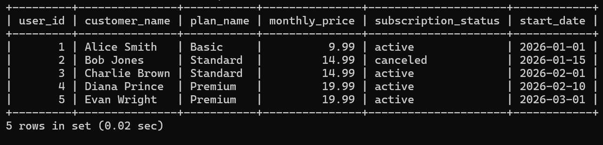
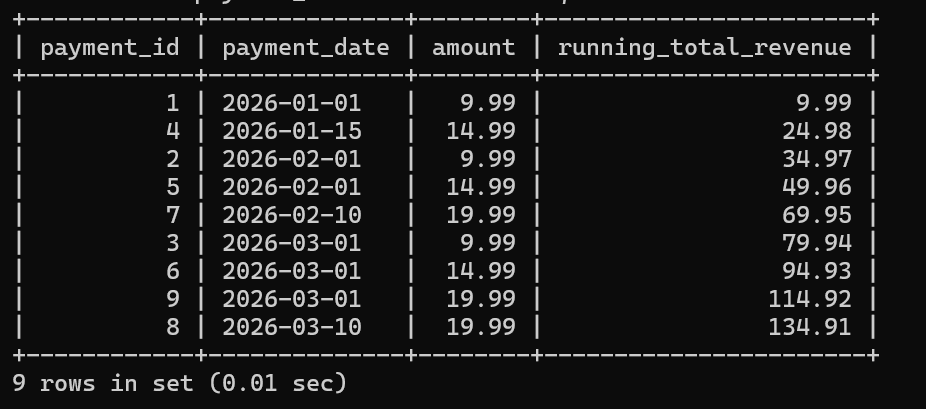
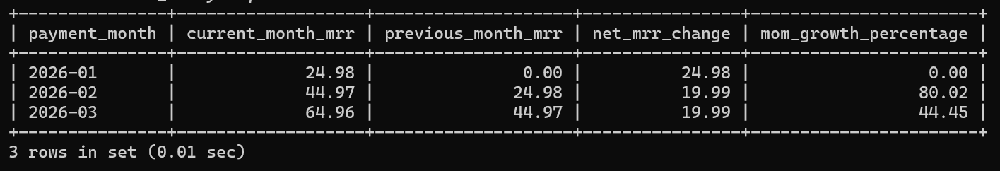

# SaaS Business Intelligence & Relational Data Modeling (MySQL)

## Project Overview
This project simulates a fully functioning, normalized relational database for a SaaS (Software as a Service) subscription platform. It establishes data schemas for users, plans, subscriptions, transactions, and behavioral logs, then uses advanced SQL programming to extract critical executive business metrics like Monthly Recurring Revenue (MRR) and Month-over-Month (MoM) growth rates.

---

## Tech Stack & Key Concepts
* **Database Engine:** MySQL
* **Database Design:** 3NF (Third Normal Form) Normalization, Primary & Foreign Key Relationships
* **Advanced SQL Used:** Common Table Expressions (CTEs), Window Functions (`LAG()`, `SUM() OVER()`), Multi-table Internal JOINs, Data Aggregations

---

## Database Schema Architecture
The schema is normalized across 5 interconnected entities to ensure zero data redundancy and maximum data integrity:
1. `users`: Core customer profiles.
2. `plans`: Subscription tiers (Basic, Standard, Premium) and pricing models.
3. `subscriptions`: Relational bridge mapping users to specific tiers and activity timelines.
4. `payments`: Ledger tracking historical financial transactions.
5. `activity_logs`: User behavioral logs tracking daily platform engagement.

---

## Analytical Pipelines & Screenshots

### 1. Unified Customer Directory (Complex JOINs)
Combines data across three tables to generate a live master file of all customers and their billing states.

**Terminal Execution Output:**

---

### 2. Cumulative Revenue Growth (Window Functions)
Computes a real-time, chronological running total of incoming revenue without collapsing row-level granular transaction records.

**Terminal Execution Output:**

---

### 3. Monthly Recurring Revenue & MoM Expansion (Multi-Layered CTEs & LAG)
The core financial model. Uses sequential CTEs to cohort transaction entries into calendar months, uses `LAG()` to pull the prior month's metrics side-by-side, and determines net financial flux and scaling percentages.

**Terminal Execution Output:**

---

## How to Run the Script
1. Clone or download the `solution.sql` file in this repository.
2. Open your preferred SQL interface (MySQL Workbench, Command Line Client, etc.).
3. Run the entire script to completely stand up the schema database, fill it with simulated mock data, and display the executive business dashboards.
